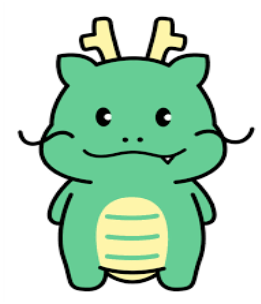
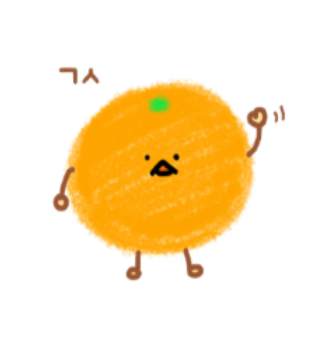
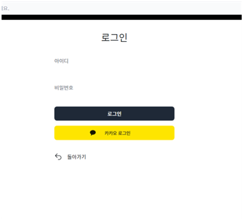
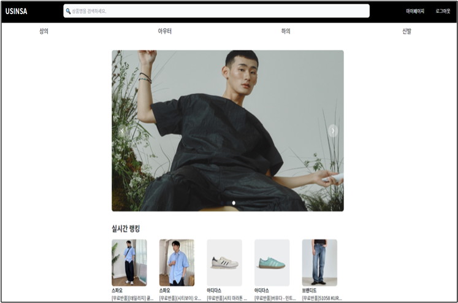
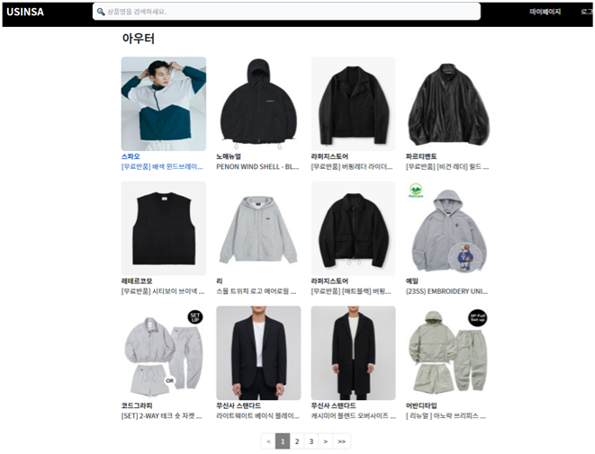
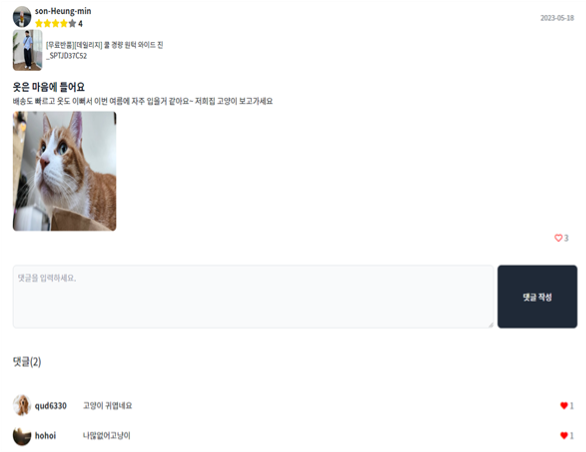
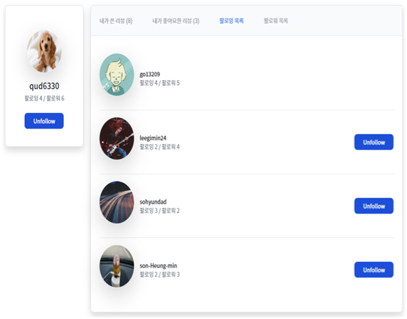
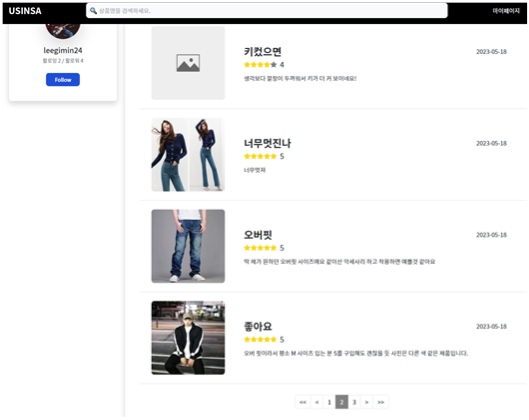

# 유신사

# 프로젝트 정보
- KDT 풀스택 개발자 취업캠프(Python) 세미 프로젝트2
- 개발기간: 2023.5.9 ~ 2023.5.19
- 깃허브 저장소 주소: https://github.com/YongJuDo/greatchoice
- 사이트 주소: https://port-0-greatchoice-1maxx2algn9knde.sel3.cloudtype.app/
- 기술 스택  
    
    
    
    
    
    
    
    
    
    
    
    
    

## 팀 소개
### 👑 팀장 : 도용주 (https://github.com/YongJuDo)

- 역할 : 프론트엔드
- 기술 스택  
    
    
    
    
    
    
    
    
    
    

- 담당
    - 무신사 사이트 데이터 크롤링
        - 무신사 데이터 기반 아이템 검색 기능
        - 카테고리별 현재 인기순위 아이템 소개
    - 메인 페이지 디자인
        - 페이지네이션
    - 리뷰 관련 페이지 디자인
        - 리뷰 작성 / 수정
        - 리뷰 별점 기능
- 프로젝트 후기  
    무신사 데이터 크롤링을 구현하면서 어려움도 많이 겪었지만 많이 배운 것 같아서 좋았습니다. 프로젝트를 진행하면서 인원이 부족하여 힘든 일정이었지만 서로 열심히 노력하여 프로젝트를 끝마칠 수 있었고, 팀원 분들께 많이 배울 수 있어서 좋은 경험이었습니다.

---

### 🍊 팀원 : 김규리 (https://github.com/go13209)

- 역할 : 프론트엔드
- 기술 스택  
    
    
    
    
    
    
    
    
    
    

- 담당
    - 계정 관련 페이지 디자인
        - 회원가입 / 로그인 / 내 정보 페이지 / 회원정보 수정
        - 유저간 팔로우 기능 비동기 처리
    - 상품 상세 페이지 디자인
    - 리뷰 상세 페이지 디자인
    - 클라우드타입을 이용한 배포
- 프로젝트 후기  
    우여곡절이 많은 프로젝트였는데 무사히 끝마치게 되어 뿌듯합니다. 부족한 점이 많았는데 다른 두 분 덕분에 많이 배우는 기회가 되었습니다. 앞으로 분발하여 팀에 더 기여할 수 있으면 좋겠습니다.

---

### 🥳 팀원 : 이태영 (https://github.com/fantael95)

- 역할 : 백엔드
- 기술 스택  
    
    
    
    
    
    
    
    
    
    
    
    
- 담당
    - 앱 accounts 모델 작성 및 기능 구현
        - 로그인(카카오 로그인 포함) / 로그아웃
        - 회원가입 / 회원정보 수정 / 회원탈퇴
        - 유저간 팔로우
        - 유저 프로필 이미지 수정 및 기본 이미지 변경 기능
    - 앱 reviews 모델 작성 및 기능 구현
        - 상품에 대한 리뷰 작성 / 수정 / 삭제
        - 리뷰에 대한 댓글 작성 / 삭제
        - 리뷰 및 댓글에 대한 좋아요
- 프로젝트 후기  
    소셜 로그인api를 적용하는게 생각보다 복잡했지만 해내고 나니 재밌었습니다. 인원수가 모자랐지만 그래서 더 자주 의견을 교환하고 더 열심히 노력한 동기가 된 것 같습니다. 앞으로도 더 성장해서 팀원들을 도와줄 수 있는 개발실력을 갖추고 싶습니다. 

# 프로젝트 소개

**무신사 데이터 기반의 패션 리뷰 사이트, “USINSA”**

**USINSA는,**

- 데이터 크롤링을 활용하여 무신사의 다양한 패션 아이템에 대한 정보를 모아놓은 곳입니다. 이를 통해 사용자들은 상품에 대한 리뷰를 공유하고, 구매 결정을 내릴 때 도움을 받을 수 있습니다.

**주요 기능**
- 개인 리뷰 작성: 사용자들은 자신이 구매한 상품에 대한 솔직하고 유용한 리뷰를 작성할 수 있습니다.
- 커뮤니티 활동: 다른 사용자들은 리뷰에 댓글을 작성하거나 좋아요를 누르는 등의 활동을 통해 소통할 수 있습니다.
- 유저 간 팔로우: 사용자는 다른 사용자를 팔로우하여 그들의 최신 패션 동향을 놓치지 않을 수 있습니다.

## 화면 구성 및 주요 기능
- 로그인
    - 소셜 로그인(카카오) 포함
    
    
    
- 메인 페이지 및 아이템 조회 페이지
    - 데이터 크롤링을 통한 실시간 인기 아이템 소개
    - 카테고리별 인기순 아이템 조회
    - 검색을 통한 아이템 조회
    - 페이지네이션

    
    
    
- 리뷰 페이지
    - 패션 아이템에 대한 리뷰
        - 사진 첨부 및 별점 기능
    - 리뷰 및 댓글에 대한 좋아요 비동기 처리

    

- 마이페이지
    - 사용자의 팔로워 및 팔로잉 수 확인 가능
    - 팔로잉 기능 비동기 처리
    - 내가 쓴 리뷰 및 '좋아요'를 누른 리뷰 확인

    
    